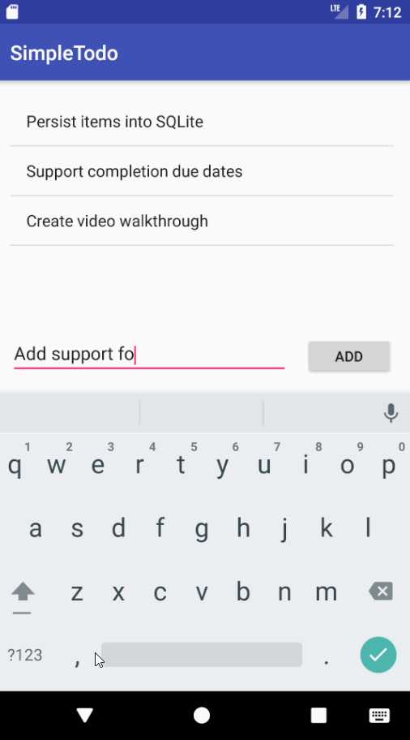

# Pre-work - SimpleTodo

SimpleTodo is an android app that allows building a todo list and basic todo items management functionality including adding new items, editing and deleting an existing item.

Submitted by John Cheu

Time spent: 4 hours spent in total

## User Stories

The following required functionality is completed:

- [x] User can successfully add and remove items from the todo list
- [x] User can tap a todo item in the list and bring up an edit screen for the todo item and then have any changes to the text reflected in the todo list.
- [x] User can persist todo items and retrieve them properly on app restart

The following optional features are implemented:

- [x] Persist the todo items [into SQLite](http://guides.codepath.com/android/Persisting-Data-to-the-Device#sqlite) instead of a text file
- [ ] Improve style of the todo items in the list [using a custom adapter](http://guides.codepath.com/android/Using-an-ArrayAdapter-with-ListView)
- [ ] Add support for completion due dates for todo items (and display within listview item)
- [ ] Use a [DialogFragment](http://guides.codepath.com/android/Using-DialogFragment) instead of new Activity for editing items
- [ ] Add support for selecting the priority of each todo item (and display in listview item)
- [ ] Tweak the style improving the UI/UX, play with colors, images or backgrounds

## Video Walkthrough

Here's a walkthrough of implemented user stories

GIF created with [LiceCap](http://www.cockos.com/licecap).

## Project Analysis

**Question 1** What are your reactions to the Android app development platform so far? Compare and contrast Android's approach to layouts and user interfaces in past platforms you've used.

This tutorial has shown Android app development to be much more effortless than I originally thought.  I really like how each screen in the app is represented as an Activity, and each Activity transitions to and relays data with other Activities through the use of Intent objects.  There was very little boilerplate code needed to handle screen transitions and data passing.  The flow feels similar to a windows application with a main editor that pops up Dialog Windows and wait for return.

The layouts and UI approach is very similar to WPF.  In both platforms, layouts are encoded in XML format and visual editor is available to ease authoring.  The relative constraints for sizing and positioning components is very robust in Android Studio and seems much easier to configure than in the Visual Studio WPF editor.  Also analogous to WPF, each layout XML has an associated logic class (Windows in WPF, Activity in Android) where event handlers and data access logic are implemented.

**Question 2** Take a moment to reflect on the `ArrayAdapter` used in your pre-work. How would you describe an adapter in this context and what is its function in Android? Why do you think the adapter is important? Explain the purpose of the `convertView` in the `getView` method of the `ArrayAdapter`.

An adapter takes a data object and transform it into a UI component on screen.  Adapters are important because they help decouple data representation from UI and allow us to customize the appearance of items in a list or tabular view.  

As a memory optimization, when a list of views are displayed on a `ListView` connected to an `ArrayAdapter`, only n number of views are instantiated to fill the visible height of the screen.  When the list scrolls, existing views that move out of screen are recycled and reused for the new items that appears on screen.  The `convertView` parameter in `getView` will be non-null when recycling happens.  In this case, instead of instantiating a new view, simply update the embeded data in the convertView.

## License

    Copyright 2017 John Cheu

    Licensed under the Apache License, Version 2.0 (the License);
    you may not use this file except in compliance with the License.
    You may obtain a copy of the License at

        http://www.apache.org/licenses/LICENSE-2.0

    Unless required by applicable law or agreed to in writing, software
    distributed under the License is distributed on an AS IS BASIS,
    WITHOUT WARRANTIES OR CONDITIONS OF ANY KIND, either express or implied.
    See the License for the specific language governing permissions and
    limitations under the License.